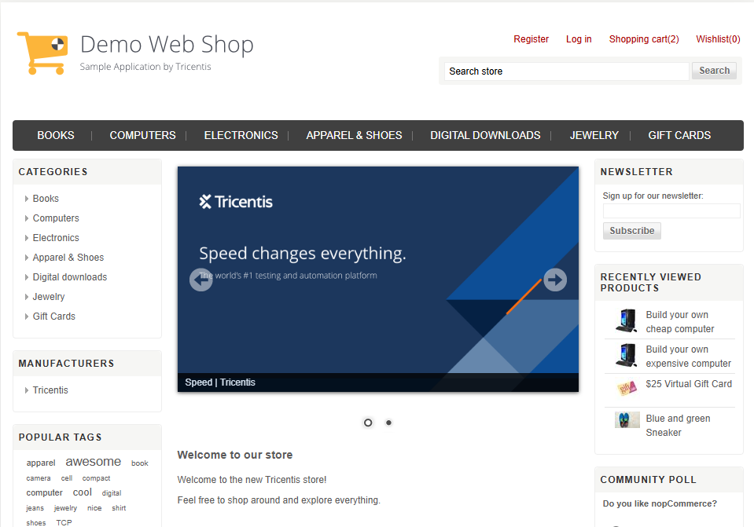
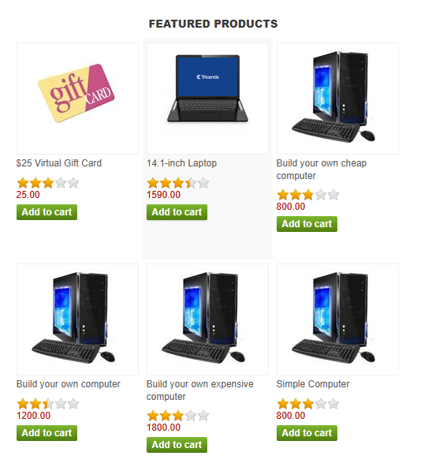
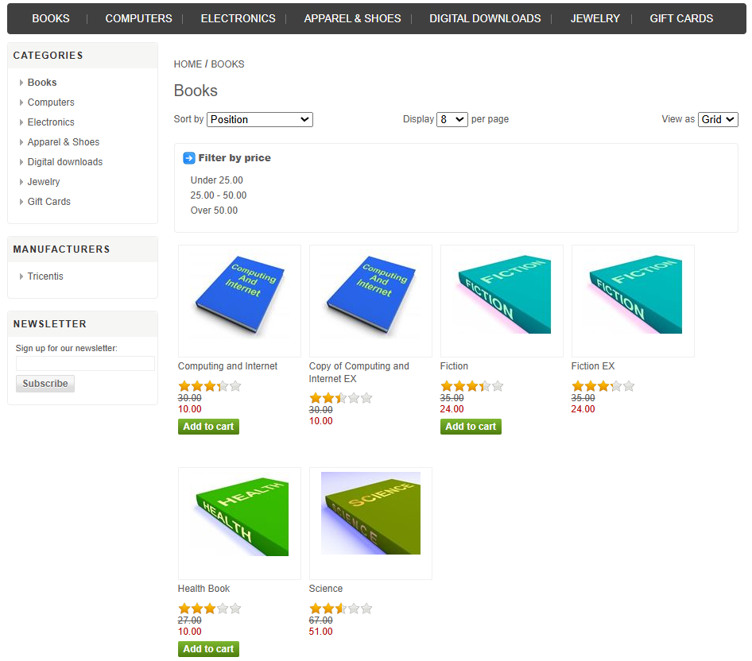
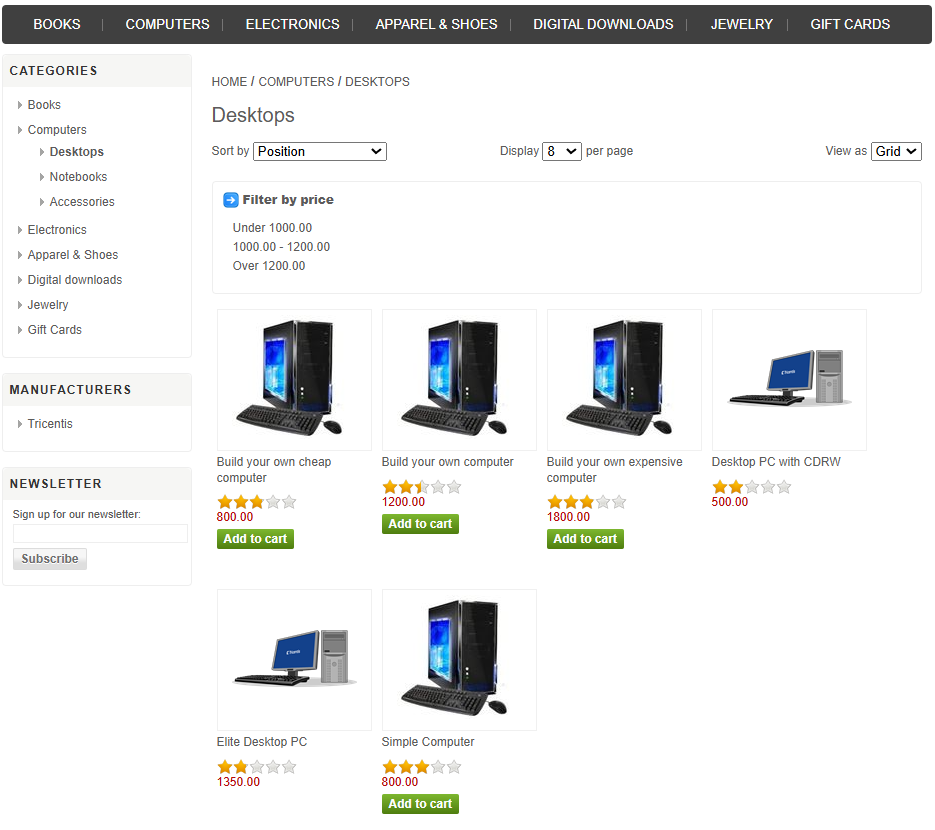
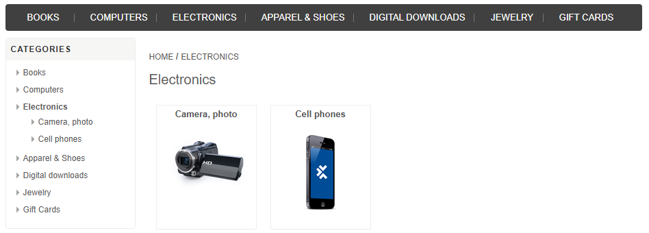
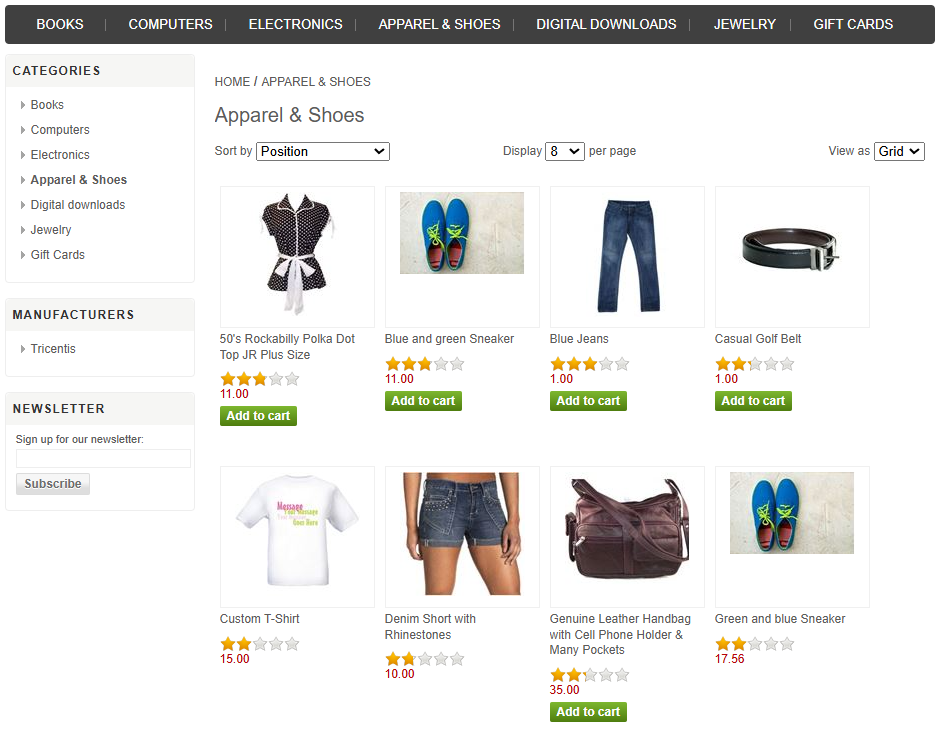
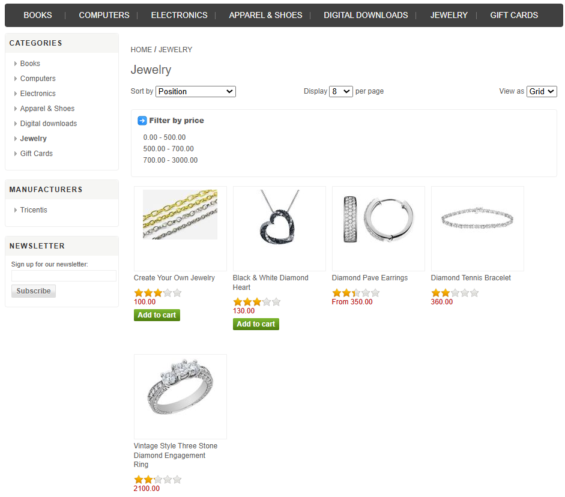
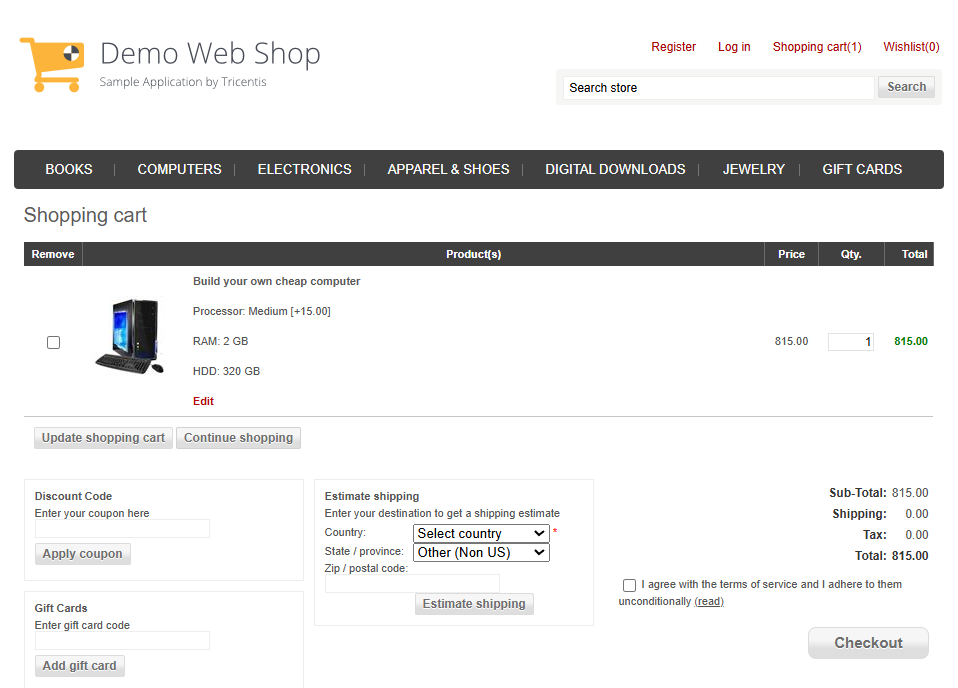

# E-Commerce Automation Test Store Testing

This Test Plan outlines the Testing Approach, Scope, and Schedule for automating test cases of the Automation 
Test Store (E - Commerce Website) Using Cypress and Page Object Model (POM).

## Objective

Validate the functionality of the website components like Register, Login, LogOut
Product Search, Add to Cart, Checkout, and Contact Forms, and Other Functionalities

## Tech Stack used in this Project

**Version Control and Testing tools used:**

**Operating System and browsers used:**

## Directory Structure
E-Commerce Automation Web Shop Testing/
├─ Web_Shop_Test_Plan
├─ Web_Shop_Test_Scenarios
├─ Web_Shop__Xmind_map
├─ Web_Shop__Bug Report
├─ Web_Shop__Summary_Report

## Application Under Test 

AUT URL: https://demowebshop.tricentis.com/

## Scope

<strong>Features to be Tested</strong>

- Register
- Login
- Button,Links Navigation
- Text Field
- Home Page
- About Us Page
- Pricing
- Contact Us Page
- Add to Cart
- Social Media Platforms
- Checkout Page
- LogOut

<strong>Testing Types</strong>

- Functional Testing
- Usability Testing
- Compatibility Testing
- Cross Browser Testing
- UI Testing
- Smoke Testing
- Security Testing

<strong>Testing Methodologies</strong>

- Black-box Testing
- System Testing
- Regression Testing
- Exploratory Testing

## Test Case Execution Status

| Test Case Status            | Build Result        |
|-----------------------------|---------------------|
| Total Number of Test Cases  | 111                  |
| Passed Test Cases           |  |
| Failed Test Cases           |  |

## Defects Status

| Defect Status   | Build Result |        
|-----------------|--------------|
| Total number    | 17           |                  
| Blocker         |  |
| Major           |  |
   

## Attachments

---

Feel free to modify or add any specific details related to your implementation or other context-specific information.

## Feedback

If you have any feedback, please reach out to me at varadx02@gmail.com